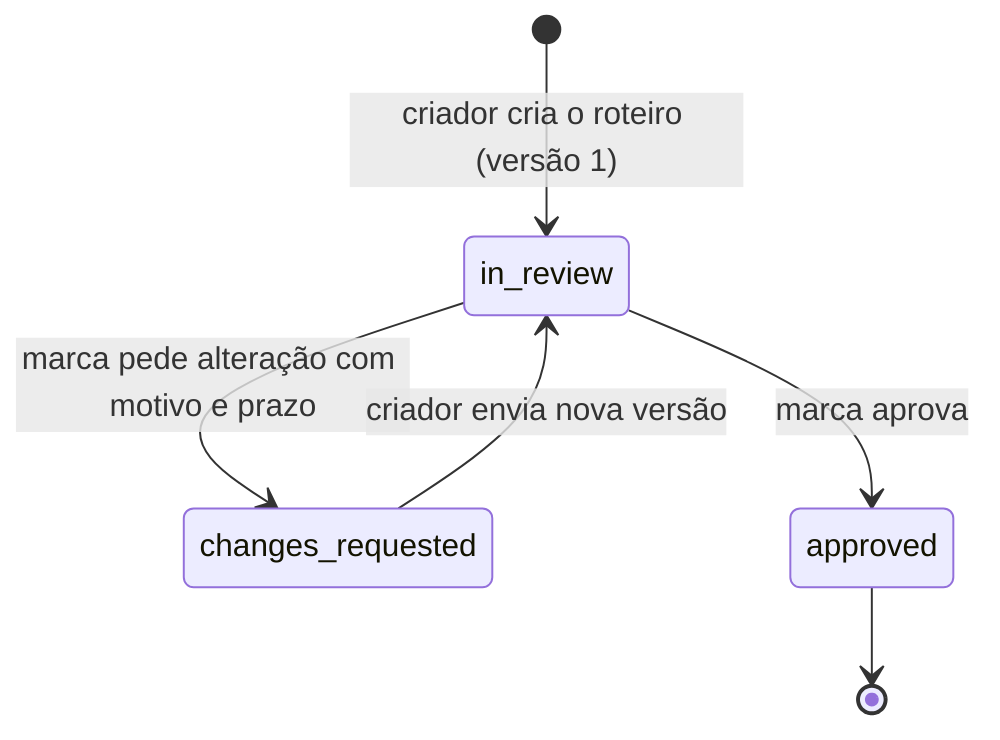

# Conty. Revisão de roteiro

API em que a marca revisa o roteiro do criador antes do vídeo. Cada envio do criador vira uma versão nova. A marca pede alteração, com motivo e prazo, ou aprova. Nenhuma versão é apagada.

## Como rodar

Node 22 ou mais novo.

```bash
npm install
npm test
npm run typecheck
npm start
```

A API sobe em `http://127.0.0.1:3003` e grava em `data/roteiros.sqlite`. `PORT` e `DB_PATH` mudam isso (veja `.env.example`). Na subida, `src/seed.ts` cadastra estes dados:

| Quem | `X-Actor` | Fuso | Campanha |
| --- | --- | --- | --- |
| Marca SP | `brand:brd_sp` | `America/Sao_Paulo` | `cmp_verao` |
| Marca Manaus | `brand:brd_manaus` | `America/Manaus` | `cmp_norte` |
| Ana | `creator:crt_ana` | | |
| Bruno | `creator:crt_bruno` | | |

## Fluxo



O estado do roteiro é o estado da versão mais recente. As versões anteriores ficam na resposta com o próprio pedido de alteração. Toda resposta diz o estado e o próximo passo:

```json
{
  "status": "changes_requested",
  "waiting_on": "creator",
  "allowed_actions": ["submit_version"],
  "current_version": 1,
  "versions": [
    {
      "number": 1,
      "status": "changes_requested",
      "late": false,
      "change_request": { "reason": "Mostrar o produto no início", "due_date": "2026-12-01", "requested_at": "..." }
    }
  ]
}
```

`waiting_on` diz quem precisa agir. `allowed_actions` diz o que quem chamou pode fazer agora.

Duas tabelas em `src/scripts.ts` decidem tudo:

```text
ALLOWED                                   ROLE
in_review          → request_changes,     request_changes → brand
                     approve              approve         → brand
changes_requested  → submit_version       submit_version  → creator
approved           → (nada)
```

Uma ação de outro papel devolve `403 forbidden`. Uma ação fora do estado devolve `409 invalid_transition`. Por isso um roteiro aprovado não aceita nova versão, novo pedido de alteração nem nova aprovação.

## Endpoints

O cabeçalho `X-Actor` diz quem chama. Sem ele, a resposta é `401 actor_required`. Cada um só vê os próprios roteiros. Para os outros, o roteiro responde `404`.

| Método e caminho | Quem | Corpo | Sucesso |
| --- | --- | --- | --- |
| `POST /scripts` | criador | `{ "campaign_id", "title", "content" }` | 201 |
| `GET /scripts?status=&campaign_id=` | os dois | | 200 |
| `GET /scripts/:id` | os dois | | 200 |
| `POST /scripts/:id/change-requests` | marca | `{ "reason", "due_date": "AAAA-MM-DD" }` | 201 |
| `POST /scripts/:id/versions` | criador | `{ "content" }` | 201 |
| `POST /scripts/:id/approve` | marca | | 200 |

Os erros têm a forma `{ "error": "mensagem", "code": "codigo" }` e são checados nesta ordem:

```text
401 actor_required
422 corpo         reason_required, due_date_required, due_date_invalid, ...
404 script_not_found
403 forbidden
409 invalid_transition
422 due_date_passed
```

[`EXEMPLOS.md`](EXEMPLOS.md) traz o fluxo inteiro com curl e as respostas reais.

## Prazo

O prazo é um dia, não um instante. O pedido vale se esse dia for hoje ou depois no fuso da marca. `src/deadline.ts` calcula o dia de hoje nesse fuso com `Intl.DateTimeFormat` e compara as datas. Não usa o dia em UTC.

Prazo `2026-10-09`, marca de São Paulo (UTC-3):

```text
UTC          2026-10-10T01:00Z     2026-10-10T02:59:59.999Z  │  2026-10-10T03:00Z
São Paulo    dia 9, 22:00          dia 9, 23:59:59.999       │  dia 10, 00:00
pedido       aceita (UTC já virou) aceita (último instante)  │  recusa, due_date_passed
```

No instante `2026-10-10T03:30Z`, o mesmo prazo vale para a marca de Manaus (UTC-4, dia 9, 23:30) e não vale para a de São Paulo (dia 10, 00:30).

Uma versão enviada depois do prazo é aceita, para não perder conteúdo, e sai com `late: true`. A regra do dia é a mesma.

Os testes controlam o relógio passando `now` para `createApp(db, { now })`.

## Onde está cada regra

```text
src/
├── app.ts        # rotas, X-Actor e validação do corpo
├── scripts.ts    # ALLOWED, ROLE e transition(): estado, papel e escrita
├── deadline.ts   # dia de hoje no fuso da marca
├── db.ts         # schema SQLite; CHECKs amarram os campos ao status
├── seed.ts       # marcas, criadores e campanhas
└── index.ts      # sobe o servidor
test/roteiros.test.ts
```

## O que ficou de fora

- Vídeo, upload e interface, como pede o enunciado.
- Autenticação. `X-Actor` só separa os papéis, e qualquer cliente pode se passar por qualquer marca ou criador.

## Com mais tempo

- Decidir com o produto o que acontece quando o prazo vence sem nova versão. Hoje o roteiro fica em `changes_requested` e a versão só chega com `late: true`.
- Controle de concorrência otimista, para vários processos no mesmo banco. Hoje `transition` é síncrona, então a checagem de estado e a escrita não têm `await` entre elas. Isso basta para um processo só.

## Uso de IA

- Feito com IA (Claude Code): leitura dos dois desafios anteriores para seguir a mesma stack, a proposta do modelo de dados (status na versão, tabelas de transição e de papel), o código, os testes, a execução com curl de `EXEMPLOS.md` e este README. Na revisão do código, a IA achou e corrigiu uma condição de corrida: um pedido de alteração concorrente com a aprovação sobrescrevia a aprovação. O teste "aprovação concorrente com pedido de alteração deixa só uma vencer" reproduz o caso.
- Revisado por mim: o modelo de estados, a regra do prazo e os testes de borda do dia, a escolha de uma separação de papéis simples em vez de autenticação e o texto deste README.
